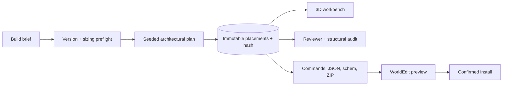

<p align="center">
  
</p>

<h1 align="center">Blockwright</h1>

<p align="center">
  <strong>From build brief to exact <code>.schem</code> — with seeded planning, version-aware palettes, 3D review, and guarded WorldEdit installation.</strong>
</p>

<p align="center">
  <a href="https://github.com/gildaltar/Blockwright/actions/workflows/ci.yml"></a>
  <a href="https://github.com/gildaltar/Blockwright/releases/latest"></a>
  
  <a href="LICENSE"></a>
</p>

<p align="center">
  <a href="#quick-start">Quick start</a> ·
  <a href="#review-what-was-actually-built">3D reviewer</a> ·
  <a href="#windows-control-center">Windows app</a> ·
  <a href="https://github.com/gildaltar/Blockwright/releases/latest">Latest release</a>
</p>

<p align="center"><sub>Original Blockwright artwork. The product captures below come from a live local v0.5.0 build.</sub></p>

> [!NOTE]
> Blockwright is an independent project. It is not an official Minecraft product and is not approved by or associated with Mojang or Microsoft.

## Design with intent. Ship with evidence.

Blockwright is a local-first Minecraft build architect delivered as a Skybridge MCP/ChatGPT App, Codex plugin, and responsive React + Three.js workbench. It turns a constrained brief into one deterministic block record, then uses that same record for the model, counts, layers, audit, hash, and every export.

| Plan architecture | Inspect precisely |
| --- | --- |
| Seeded plans vary structure, circulation, rooms, roof language, and palette—not just surface blocks. | Select exact blocks or regions, inspect state and phase data, measure spans, search coordinates, and navigate audit findings. |
| **Export real artifacts** | **Operate locally** |
| Produce JSON, CSV, Java or Bedrock functions, Sponge v3 `.schem`, layer blueprints, and checksummed bundles. | Keep texture packs on-device, discover Java worlds read-only, and preview every WorldEdit install before confirmation. |

<p align="center">
  
</p>

<p align="center"><sub>Live v0.5.0 capture: 4,361 exact Java 26.2 placements from seed <code>readme-050</code>, rendered with procedural fallback materials.</sub></p>

## One build record, every downstream result



There is no decorative count and no second, looser export model. If a coordinate, material, layer, or hash appears in the interface, it comes from the canonical compiled record.

## Review what was actually built

The dedicated reviewer is for decisions, not just orbiting a model. It understands block states and renders shape-aware stairs, slabs, doors, trapdoors, panes, fences, walls, and lanterns. Whole-build auditing groups recurring structural problems and keeps every affected coordinate navigable.

<p align="center">
  
</p>

<p align="center"><sub>A real audit focus at <code>1,17,1</code>: exact bounds, block identifier, state, generation phase, issue category, and review status remain visible together.</sub></p>

- Block and box selection with inclusive dimensions, occupied count, volume, palette breakdown, and phase breakdown.
- Coordinate, block, phase, and state search with keyboard-accessible camera presets and layer clipping.
- Distance measurement kept separate from annotations so measurements never become accidental change requests.
- `change`, `fix`, `remove`, and `liked` annotations with open/resolved status, editing, filtering, undo, and portable JSON import/export.
- Global defect-class audits for support, contact, connection state, incomplete multi-block structures, overlaps, and related recurring problems.

## Windows Control Center

Running Blockwright from a Windows PC does not require babysitting a terminal. The native WPF control center owns the local process it starts and exposes the information that matters while it is running.

<p align="center">
  
</p>

<p align="center"><sub>Native UI during a real local v0.5.0 run. The repository-root label was generalized for this public capture.</sub></p>

- Start, stop, and restart the server without leaving orphaned child processes.
- Verify Node.js/npm requirements, manifest alignment, packaged files, runtime dependencies, registries, MCP launch configuration, and generated-build synchronization.
- Show health, readiness, PID, uptime, endpoint, exit state, timestamped live logs, and copy/save actions.
- Repair the production-only runtime from the lockfile under a shared, ownership-checked maintenance lock.

Launch [`scripts/windows/Launch-Blockwright-ControlCenter.vbs`](scripts/windows/Launch-Blockwright-ControlCenter.vbs), or use the optional [shortcut installer](scripts/windows/README.md).

## Quick start

Requirements: Node.js 22.23.1 or newer and npm.

```bash
git clone https://github.com/gildaltar/Blockwright.git
cd Blockwright
npm ci
npm run dev
```

Open `http://localhost:3000`, run `compile_build`, then choose **Open workbench**. The local MCP endpoint is `http://localhost:3000/mcp`.

### Choose how you use it

| Surface | Start here |
| --- | --- |
| Local workbench + MCP | `npm run dev` |
| ChatGPT App development | `npm run dev:tunnel`, then connect `{forwarding-url}/mcp` in ChatGPT Developer Mode |
| Codex plugin | Use the checked-in `.codex-plugin/plugin.json`, bundled skill, local stdio bridge, and production workbench |
| Native Windows app | Open `scripts/windows/Launch-Blockwright-ControlCenter.vbs` |
| Container or hosted MCP | Build the included `Dockerfile`, or deploy the Skybridge server with your preferred compatible host |

<p align="center">
  
</p>

<p align="center"><sub>The same build workflow adapts to compact hosts without horizontal overflow.</sub></p>

## Accuracy boundaries

Blockwright makes its compatibility boundary visible instead of treating “Minecraft” as one undifferentiated target.

| Area | Current boundary |
| --- | --- |
| Java registry | Included Java 26.2 registry: 1,198 namespaced block identifiers derived from the SHA-1-verified official client JAR |
| Bedrock registry | Separate identifiers sourced from Microsoft's `@minecraft/vanilla-data`; Java and Bedrock identifiers are never mixed |
| Textures | Resource-pack ZIPs and client JARs stay in the browser; Blockwright does not bundle or upload Mojang texture artwork |
| Schematic export | GZip-compressed Sponge Schematic v3, verified with WorldEdit CLI 7.4.4 against Java 26.2 data |
| World access | Java-world discovery is read-only; installation writes a reversible WorldEdit schematic only after preview and confirmation |
| Direct save editing | Java Anvil editing, Bedrock LevelDB, and `.mcworld` writers are explicitly unavailable |

See the [fidelity ledger](FIDELITY.md) for the visual/technical boundary and the [specification](SPEC.md) for acceptance criteria.

<details>
<summary><strong>What ships in v0.5.0</strong></summary>

- 27 MCP tools with human-readable titles, parameter guidance, structured outputs, and invocation states.
- Adaptive palette interviews, durable named palettes, exact-version validation, and role locking/replacement.
- Seeded architectural candidates and modular courtyard, interlocking-volume, tower, and framed-hall generators.
- Green/amber/red sizing preflight with volume, placements, chunks, regions, commands, and export-size estimates.
- Live Java release checking and SHA-1-verified registry synchronization.
- Real Sponge v3 import/export, Java and Bedrock functions, blueprints, CSV, JSON, and checksummed bundles.
- Local Java-world discovery and atomic, re-verified WorldEdit installation.
- Liveness at `/health`, readiness at `/ready`, and the Streamable HTTP MCP endpoint at `/mcp`.
- A reusable Blockwright skill and a compiled Nordic Hearth Lodge example.

</details>

<details>
<summary><strong>Project map</strong></summary>

- `src/lib/compiler.ts` — deterministic voxel compiler.
- `src/lib/preflight.ts` — configurable size/resource risk estimation and confirmation tokens.
- `src/lib/palette-studio.ts` — adaptive palette state and durable named palettes.
- `src/lib/reviewer.ts` — whole-build state/contact/support/connection audit and portable review types.
- `src/lib/schematic.ts` — Sponge Schematic v3 NBT import/export.
- `src/lib/worlds.ts` — safe `level.dat` discovery and guarded WorldEdit installation.
- `src/lib/exports.ts` — construction exports and checksummed bundles.
- `src/views/compile-build.tsx` — seeded 3D workbench and textured role palette.
- `src/views/review-build.tsx` — exact-coordinate reviewer and annotation workflow.
- `src/server.ts` — MCP tools and shared view registration.
- `mcp/server.mjs` — resilient stdio-to-local-HTTP bridge for the Codex plugin.
- `scripts/diagnose.mjs` — read-only source or installed-plugin diagnostics.
- `scripts/windows/` — native Windows controller, launchers, runtime repair, tests, and operator notes.
- `examples/nordic-hearth-lodge/` — generated example artifacts.

</details>

## Verify it

```bash
npm test
npm run sample
npm run build
npm run diagnose
```

`npm run verify` runs the test suite, production build, plugin packaging, runtime-lock check, production dependency installation, and read-only diagnostics. CI also rejects packaged output that has drifted from source.

## Documentation

- [Product specification](SPEC.md)
- [Visual design notes](DESIGN.md)
- [Fidelity and accuracy ledger](FIDELITY.md)
- [Windows operator guide](scripts/windows/README.md)
- [Release history](CHANGELOG.md)
- [Media provenance](assets/github/README.md)

Blockwright is available under the [GNU General Public License v2.0](LICENSE).
