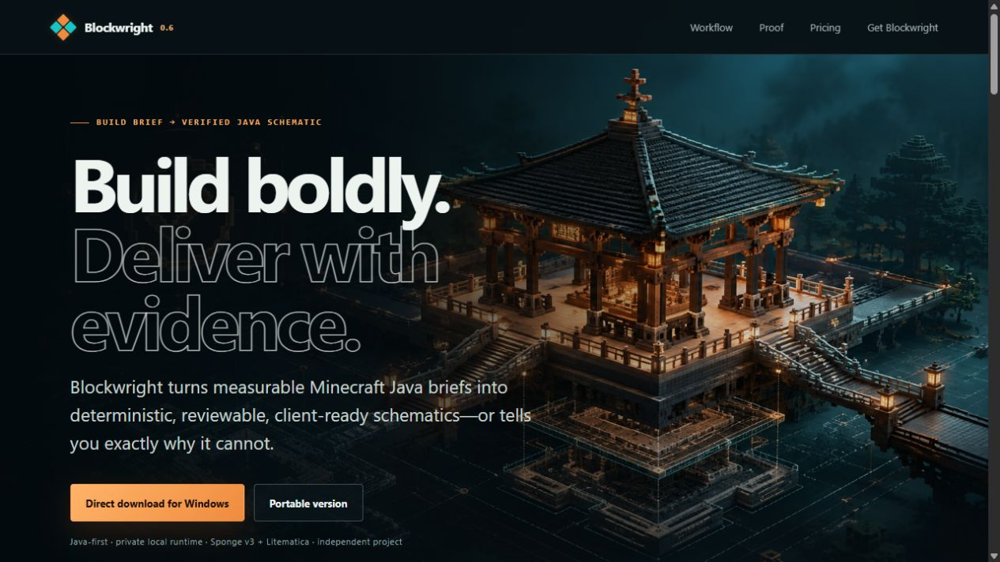
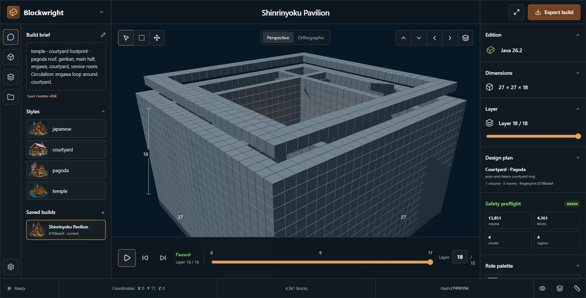
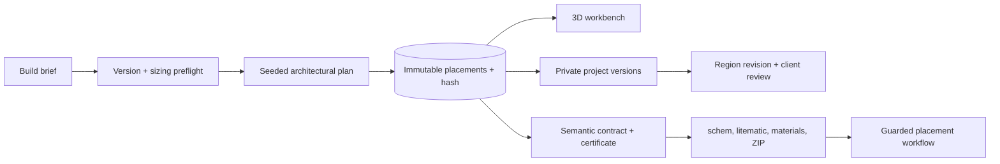
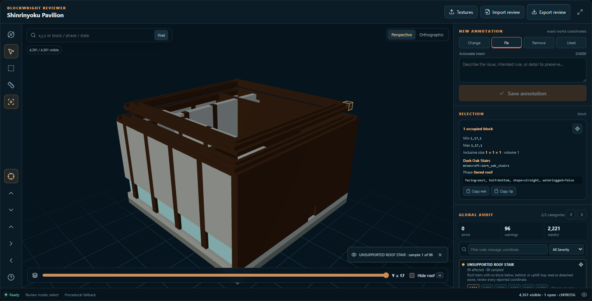
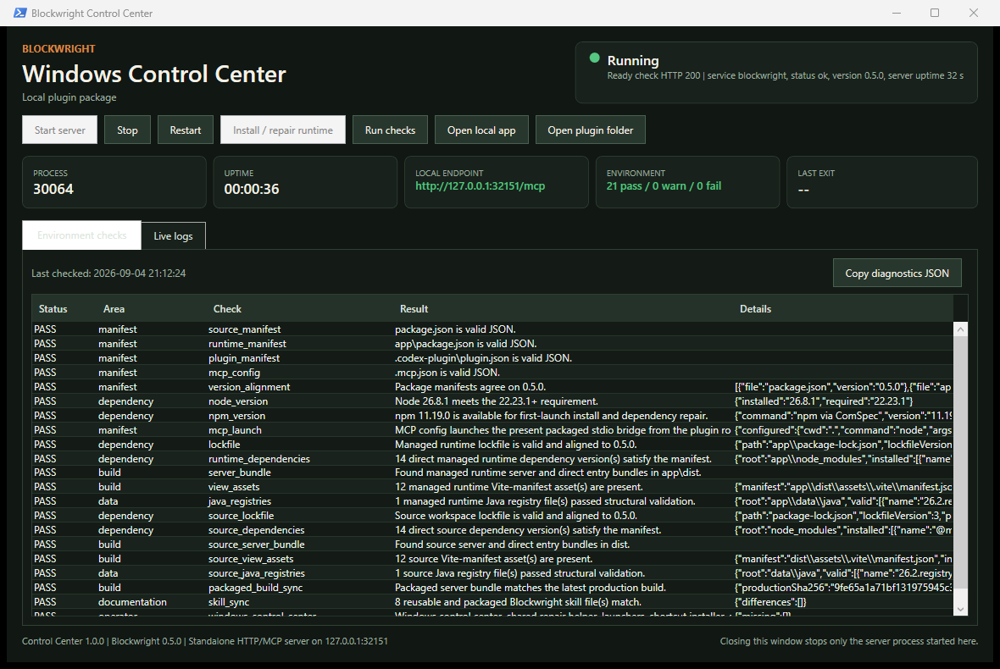
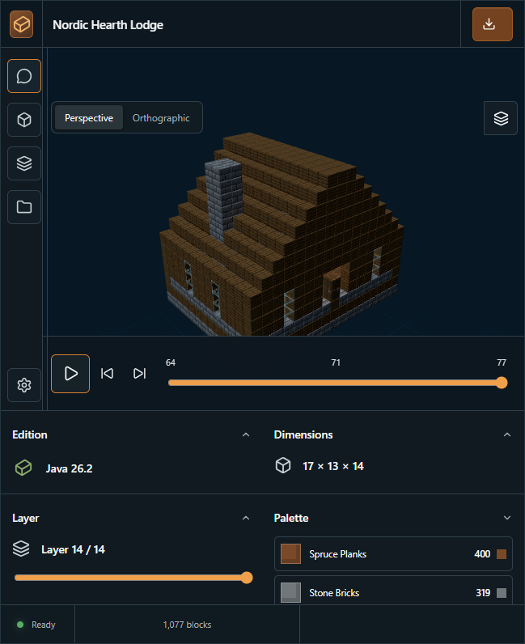

<p align="center">
  
</p>

<h1 align="center">Blockwright</h1>

<p align="center">
  <strong>Turn a measurable Minecraft brief into a deterministic Java build, fail-closed certificate, client review, and delivery-ready schematic.</strong>
</p>

<p align="center">
  <a href="https://github.com/gildaltar/Blockwright/actions/workflows/ci.yml"></a>
  <a href="https://github.com/gildaltar/Blockwright/releases/latest"></a>
  
  <a href="LICENSE"></a>
</p>

<p align="center">
  <a href="#quick-start">Quick start</a> ·
  <a href="#review-what-was-actually-built">3D reviewer</a> ·
  <a href="#windows-control-center">Windows app</a> ·
  <a href="https://github.com/gildaltar/Blockwright/releases/latest">Latest stable release</a>
</p>

<p align="center"><sub>Original v0.6.0 Blockwright artwork. Illustrative art is labeled separately from live product captures.</sub></p>

> [!NOTE]
> Blockwright is an independent project. It is not an official Minecraft product and is not approved by or associated with Mojang or Microsoft.

## Design with intent. Ship with evidence.

Blockwright is a local-first Minecraft build architect delivered as a self-contained Windows app, portable package, Skybridge MCP/ChatGPT App, Codex plugin, and responsive React + Three.js workbench. It turns a constrained brief into one deterministic block record, then uses that same record for the model, counts, layers, semantic contract, version history, audit, hash, and every export.

| Plan architecture | Inspect precisely |
| --- | --- |
| Seeded plans vary structure, circulation, rooms, roof language, and palette—not just surface blocks. | Select exact blocks or regions, inspect state and phase data, measure spans, search coordinates, and navigate audit findings. |
| **Export real artifacts** | **Operate locally** |
| Produce JSON, CSV, functions, Sponge v3 `.schem`, experimental `.litematic`, material plans, certificates, and checksummed client bundles. | Keep texture packs on-device, autosave private projects, discover Java worlds read-only, and preview every WorldEdit install before confirmation. |

<p align="center">
  
</p>

<p align="center"><sub>Live v0.6.0 product capture. Hosted account and checkout controls remain disabled unless their provider configuration is actually present.</sub></p>

<p align="center">
  
</p>

<p align="center"><sub>Live v0.5.0 capture: 4,361 exact Java 26.2 placements from seed <code>readme-050</code>, rendered with procedural fallback materials.</sub></p>

## One build record, every downstream result



There is no decorative count and no second, looser export model. If a coordinate, material, layer, contract result, version diff, or hash appears in the interface, it comes from the canonical compiled record. Unsupported hard requirements fail closed instead of being silently treated as complete.

## Review what was actually built

The dedicated reviewer is for decisions, not just orbiting a model. It understands block states and renders shape-aware stairs, slabs, doors, trapdoors, panes, fences, walls, and lanterns. Whole-build auditing groups recurring structural problems and keeps every affected coordinate navigable.

<p align="center">
  
</p>

<p align="center"><sub>A real audit focus at <code>1,17,1</code>: exact bounds, block identifier, state, generation phase, issue category, and review status remain visible together.</sub></p>

- Block and box selection with inclusive dimensions, occupied count, volume, palette breakdown, and phase breakdown.
- Coordinate, block, phase, and state search with keyboard-accessible camera presets and layer clipping.
- Distance measurement kept separate from annotations so measurements never become accidental change requests.
- `change`, `fix`, `remove`, and `liked` annotations with open/resolved status, editing, filtering, undo, and portable JSON import/export.
- Global defect-class audits for support, contact, connection state, incomplete multi-block structures, overlaps, and related recurring problems.

## Windows Control Center

Running Blockwright from a Windows PC does not require babysitting a terminal. The native WPF control center owns the local process it starts and exposes the information that matters while it is running.

<p align="center">
  
</p>

<p align="center"><sub>Real render-only v0.6.0 UI capture in a stopped disposable fixture. Rendering starts no server or update operation; the one warning records the intentionally absent production dependency tree in that fixture.</sub></p>

- Start, stop, and restart the server without leaving orphaned child processes.
- Verify Node.js/npm requirements, manifest alignment, packaged files, runtime dependencies, registries, MCP launch configuration, and generated-build synchronization.
- Show health, readiness, PID, uptime, endpoint, exit state, timestamped live logs, and copy/save actions.
- Repair the production-only runtime from the lockfile under a shared, ownership-checked maintenance lock.
- Check the protected release channel asynchronously, verify transport, size, version, checksum, and the configured Authenticode publisher, then ask before downloading and verifying again for installation.

Launch [`scripts/windows/Launch-Blockwright-ControlCenter.vbs`](scripts/windows/Launch-Blockwright-ControlCenter.vbs), or use the optional [shortcut installer](scripts/windows/README.md).

The v0.8 source package adds an all-users/current-user installer choice and two independent, opt-in sign-in modes: visible Control Center or minimized background engine. All-users setup keeps configuration, credentials, projects, Codex registration, and `.schem` association per account. This source change does not itself publish or sign a v0.8 installer.

## Quick start

For Windows, download the exact v0.6.0 MVP prerelease as either the [per-user installer](https://github.com/gildaltar/Blockwright/releases/download/v0.6.0/Blockwright-0.6.0-windows-x64-setup.exe) or the [portable ZIP](https://github.com/gildaltar/Blockwright/releases/download/v0.6.0/Blockwright-0.6.0-windows-x64-portable.zip). Both carry a private pinned Node.js runtime and do not modify a machine-wide Node installation. The installer uses `%LOCALAPPDATA%\Programs\Blockwright` and does not require administrator access; for the portable build, extract the whole ZIP before running `scripts\windows\Start-Blockwright-Portable.cmd`.

> [!WARNING]
> **Blockwright 0.6.0 is an unsigned Windows MVP prerelease.** Its setup program will show an unknown publisher, and Microsoft Defender SmartScreen may display **Windows protected your PC**. Download it only from the [official v0.6.0 release page](https://github.com/gildaltar/Blockwright/releases/tag/v0.6.0), compare the file's SHA-256 with `SHA256SUMS.txt` from that page (`Get-FileHash .\Blockwright-0.6.0-windows-x64-setup.exe -Algorithm SHA256`), and continue through **More info → Run anyway** only if the hash matches and you trust this repository. A matching checksum detects a damaged or changed download; it is not a publisher signature. The built-in updater intentionally refuses this unsigned prerelease, so install later prereleases manually.

For source development:

Requirements: Node.js 22.23.1 or newer and npm.

```bash
git clone https://github.com/gildaltar/Blockwright.git
cd Blockwright
npm ci
npm run dev
```

Open `http://localhost:3000`, run `compile_build`, then choose **Open workbench**. The local MCP endpoint is `http://localhost:3000/mcp`.

### Choose how you use it

| Surface | Start here |
| --- | --- |
| Local workbench + MCP | `npm run dev` |
| ChatGPT App development | `npm run dev:tunnel`, then connect `{forwarding-url}/mcp` in ChatGPT Developer Mode |
| Codex plugin | Use the checked-in `.codex-plugin/plugin.json`, bundled skill, local stdio bridge, and production workbench |
| Self-contained Windows app | Install the Windows package (v0.8 source supports current-user or all-users scope) or run `scripts/windows/Start-Blockwright-Portable.cmd` from the extracted portable package |
| Container or hosted MCP | Build the included `Dockerfile` and run the bounded Node listener with a persistent private volume; production serverless adapters deliberately refuse hosted mode |

<p align="center">
  
</p>

<p align="center"><sub>The same build workflow adapts to compact hosts without horizontal overflow.</sub></p>

## Accuracy boundaries

Blockwright makes its compatibility boundary visible instead of treating “Minecraft” as one undifferentiated target.

| Area | Current boundary |
| --- | --- |
| Java registry | Included Java 26.2 registry: 1,198 namespaced block identifiers derived from the SHA-1-verified official client JAR |
| Bedrock registry | Separate identifiers sourced from Microsoft's `@minecraft/vanilla-data`; Java and Bedrock identifiers are never mixed |
| Textures | Blockwright does not ship Mojang texture artwork. User-selected resource packs remain client-side; optional exact-version synchronization may derive a local ignored resource archive from a SHA-1-verified client JAR, but release packaging rejects that archive |
| Schematic export | GZip-compressed Sponge Schematic v3, verified with WorldEdit CLI 7.4.4 against Java 26.2 data |
| Litematica export | Single-region Litematic v7 import/export is implemented with bounded NBT parsing; compatibility stays explicitly `unverified` until a real Litematica open/place/re-save round trip is recorded |
| World access | Java-world discovery is read-only; installation writes a reversible WorldEdit schematic only after preview and confirmation |
| Direct save editing | Java Anvil editing, Bedrock LevelDB, and `.mcworld` writers are explicitly unavailable |
| Hosted service | Accounts, tenant-isolated projects, expiring review links, deletion, quotas, and Stripe handoff are configuration-gated; production hosted mode fails readiness when billing, the trusted ingress-hop count, or a 32+ character registration access key is omitted. Registration is additionally bounded by global daily and total-tenant caps. An unbilled hosted development deployment requires the explicit `BLOCKWRIGHT_ALLOW_UNBILLED_HOSTED_DEVELOPMENT=1` escape hatch |

See the [fidelity ledger](FIDELITY.md) for the visual/technical boundary and the [specification](SPEC.md) for acceptance criteria.

<details>
<summary><strong>What ships in v0.6.0</strong></summary>

- A professional MCP workflow with human-readable titles, parameter guidance, structured outputs, invocation states, and private app-only payload helpers.
- Compile and review views receive an immutable build shell plus at most 500 initial placements, then load remaining exact blocks sequentially through private pages of at most 5,000. Hosted pages come only from a 15-minute tenant-and-user-scoped cache; an expired or evicted view fails closed and asks for a fresh compile or review.
- Hash-bound semantic contracts that audit entrances, clearance, spawn safety, requested spaces, explicit lighting, interiors, support, palette, version, origin, and budget; unsupported hard clauses block delivery.
- Durable private projects with autosave, immutable version history, diffs, restore-as-new-version, selected-region revision, and exact-snapshot client review links.
- Adaptive palette interviews, durable named palettes, exact-version validation, and role locking/replacement.
- Seeded architectural candidates and modular courtyard, interlocking-volume, tower, and framed-hall generators.
- Green/amber/red sizing preflight with volume, placements, chunks, regions, commands, and export-size estimates.
- Live Java release checking and SHA-1-verified registry synchronization.
- Real Sponge v3 import/export, bounded Litematic v7 support, exact material lists, Java and Bedrock functions, blueprints, CSV, JSON, and checksummed delivery bundles.
- Local Java-world discovery and atomic, re-verified WorldEdit installation.
- A per-user Windows installer and portable ZIP with a pinned private runtime, SBOMs, SHA-256 manifests, updater verification, support bundles, optional Codex registration, and reversible `.schem` association.
- Hosted browser foundations for identity, tenant-scoped storage, project creation and bounded inspection, immutable history comparison and restore, expiring review-link creation, account deletion, rate limits, telemetry controls, billing checkout/portal/invoice handoff, and refund requests—enabled only when operator configuration is complete.
- A labeled 100-brief synthetic acceptance corpus. Real customer case studies remain an external launch requirement and are never fabricated.
- Liveness at `/health`, readiness at `/ready`, and the Streamable HTTP MCP endpoint at `/mcp`.
- PC-local production binds only to `127.0.0.1`; its bridge or Control Center creates a fresh in-memory 256-bit bearer token for every launch, and Host, Origin, token, declared body size, and ingress concurrency are checked before MCP JSON parsing. Hosted v0.6 runs only through the bounded production Node listener with a persistent volume and performs hosted MCP authentication/rate checks at the same pre-body boundary. Production Vercel and Cloudflare adapters fail closed until Blockwright has a durable hosted data adapter that can guarantee tenant isolation and deletion across requests.
- A reusable Blockwright skill and a compiled Nordic Hearth Lodge example.

</details>

<details>
<summary><strong>Project map</strong></summary>

- `src/lib/compiler.ts` — deterministic voxel compiler.
- `src/lib/contract.ts` — normalized fail-closed requirements, semantic evaluation, and hash-bound certificates.
- `src/lib/projects.ts` — private projects, autosave, immutable versions, diffs, restore, and review tokens.
- `src/lib/revision.ts` — selected-region replacement with outside-region preservation and contract revalidation.
- `src/lib/litematic.ts` — bounded single-region Litematic v7 import/export.
- `src/lib/delivery.ts` — exact material counts and checksummed professional delivery bundles.
- `src/lib/hosted-service.ts` — hosted identity, tenant persistence, sessions, usage, deletion, and support records.
- `src/lib/preflight.ts` — configurable size/resource risk estimation and confirmation tokens.
- `src/lib/palette-studio.ts` — adaptive palette state and durable named palettes.
- `src/lib/reviewer.ts` — whole-build state/contact/support/connection audit and portable review types.
- `src/lib/schematic.ts` — Sponge Schematic v3 NBT import/export.
- `src/lib/worlds.ts` — safe `level.dat` discovery and guarded WorldEdit installation.
- `src/lib/exports.ts` — construction exports and checksummed bundles.
- `src/views/compile-build.tsx` — seeded 3D workbench and textured role palette.
- `src/views/review-build.tsx` — exact-coordinate reviewer and annotation workflow.
- `src/server.ts` — MCP tools and shared view registration.
- `mcp/server.mjs` — resilient stdio-to-local-HTTP bridge for the Codex plugin.
- `scripts/diagnose.mjs` — read-only source or installed-plugin diagnostics.
- `scripts/windows/` — native Windows controller, launchers, runtime repair, tests, and operator notes.
- `examples/nordic-hearth-lodge/` — generated example artifacts.

</details>

## Verify it

```bash
npm test
npm run benchmark:v060
npm run sample
npm run build
npm run diagnose
```

`npm run verify` runs the test suite, production build, plugin packaging, runtime-lock check, production dependency installation, and read-only diagnostics. Windows release verification additionally checks the private runtime, SBOMs, hashes, signed-installer policy, install/upgrade/repair/uninstall lifecycle, and cleanup ownership boundaries. CI rejects packaged output that has drifted from source.

The public v0.6.0 Windows build is a deliberately unsigned, explicitly labeled MVP prerelease. Its exact tagged release, checksum manifest, SBOMs, and machine-readable signature-status file define that limited distribution boundary; it does not satisfy the signed-release gate and is not eligible for the automatic updater or WinGet. Signed stable releases remain the preferred channel and still require a real publisher certificate, protected signing configuration, final installer testing, provenance, and approval of the separate exact-ID publication workflow. Protected/immutable release tags, GitHub immutable releases, custom-domain DNS, live Stripe credentials, WinGet submission, real Litematica interoperability, and consented customer case studies remain separate external gates.

## Documentation

- [Product specification](SPEC.md)
- [Visual design notes](DESIGN.md)
- [Fidelity and accuracy ledger](FIDELITY.md)
- [Windows operator guide](scripts/windows/README.md)
- [Release history](CHANGELOG.md)
- [Media provenance](assets/github/README.md)

Blockwright is available under the [GNU General Public License v2.0](LICENSE).
